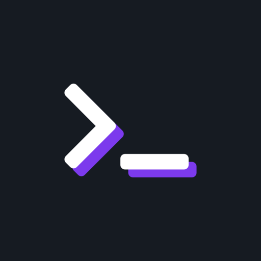

<div align="center">
<!-- ALL-CONTRIBUTORS-BADGE:START - Do not remove or modify this section -->
[](#contributors-)
<!-- ALL-CONTRIBUTORS-BADGE:END -->
  <a href="https://discoverweekly.dev"></a>

  <br/>

  <p><strong>DiscoverWeekly.dev</strong> - The playlists made by devs, every Wednesday.</p>

  <br/>


[](https://github.com/peterpeterparker/discoverweekly.dev/releases/latest)
[](https://twitter.com/intent/tweet?url=https%3A%2F%2Fdiscoverweekly.dev&text=Checkout%20DiscoverWeekly.dev%20by%20%40daviddalbusco%20%F0%9F%A4%9F)

</div>

## Table of contents

- [Contributing](#contributing)
- [Add a new playlist](#add-a-new-playlist)
- [Run the project locally](#run-the-project-locally)
- [License](#license)

## Contributing

Make sure you have a recent version of [Node.js installed](https://nodejs.org/en/) (LTS recommended).

Fork and clone this repository. Head over to your terminal and run the following command:

```
git clone git@github.com:[YOUR_USERNAME]/discoverweekly.dev.git
cd discoverweekly.dev
npm ci
npm run add:playlist
```

## Add a new playlist

`npm run add:playlist` will ask for your name and create a file in `./content/playlists/`.

Continue by editing this generated `Markdown` file.

Have a look at the [CONTRIBUTING.md](./CONTRIBUTING.md) for further information about the edition of your playlist details.

Commit the changes and [open a pull request](https://help.github.com/en/github/collaborating-with-issues-and-pull-requests/creating-a-pull-request).

## Run the project locally

This project is a [Next.js](https://nextjs.org/) project.

```
npm run dev
```

## License

MIT © [David Dal Busco](mailto:david.dalbusco@outlook.com)

## Contributors ✨

Thanks goes to these wonderful people ([emoji key](https://allcontributors.org/docs/en/emoji-key)):

<!-- ALL-CONTRIBUTORS-LIST:START - Do not remove or modify this section -->
<!-- prettier-ignore-start -->
<!-- markdownlint-disable -->
<table>
  <tr>
    <td align="center"><a href="http://www.facebook.com/renato.lousan"><br /><sub><b>Renato Lousan da Silva</b></sub></a><br /><a href="#blog-renatolousan" title="Blogposts">📝</a></td>
    <td align="center"><a href="https://francoisbest.com"><br /><sub><b>François Best</b></sub></a><br /><a href="#blog-franky47" title="Blogposts">📝</a></td>
    <td align="center"><a href="https://sandro.scalco.ch"><br /><sub><b>Sandro Scalco</b></sub></a><br /><a href="#blog-sansan88" title="Blogposts">📝</a></td>
  </tr>
</table>

<!-- markdownlint-restore -->
<!-- prettier-ignore-end -->

<!-- ALL-CONTRIBUTORS-LIST:END -->

This project follows the [all-contributors](https://github.com/all-contributors/all-contributors) specification. Contributions of any kind welcome!